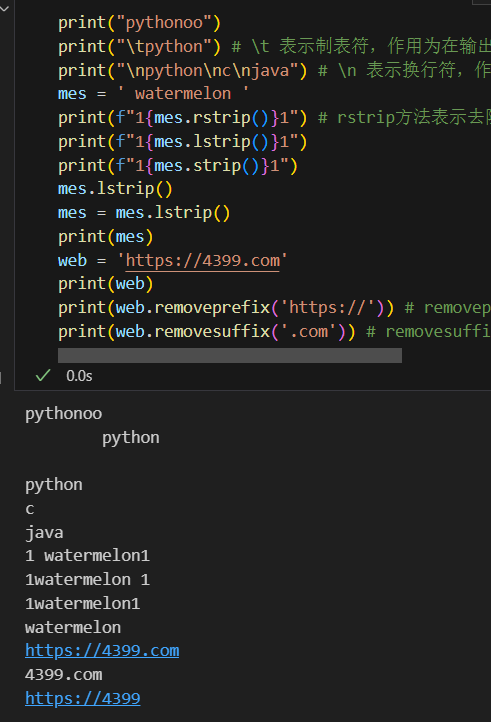

# 实验二 Python变量、简单数据类型

班级： 21计科3班

学号： B20210302324

姓名： 唐佳喜

Github地址：https://github.com/Jecxy/Python_Learning

---

## 实验目的

1. 使用VSCode编写和运行Python程序
2. 学习Python变量和简单数据类型

## 实验环境

1. Git
2. Python 3.10
3. VSCode
4. VSCode插件

## 实验内容和步骤

### 第一部分

实验环境的安装

1. 安装Python，从Python官网下载Python 3.10安装包，下载后直接点击可以安装：[Python官网地址](https://www.python.org/downloads/)
2. 为了在VSCode集成环境下编写和运行Python程序，安装下列VScode插件
   - Python
   - Python Environment Manager
   - Python Indent
   - Python Extended
   - Python Docstring Generator
   - Jupyter
   - indent-rainbow
   - Jinja

---

### 第二部分

Python变量、简单数据类型和列表简介

完成教材《Python编程从入门到实践》下列章节的练习：

- 第2章 变量和简单数据类型

---

### 第三部分

在[Codewars网站](https://www.codewars.com)注册账号，完成下列Kata挑战：

---

#### 第1题：求离整数n最近的平方数（Find Nearest square number）

难度：8kyu

你的任务是找到一个正整数n的最近的平方数
例如，如果n=111，那么nearest_sq(n)（nearestSq(n)）等于121，因为111比100（10的平方）更接近121（11的平方）。
如果n已经是完全平方（例如n=144，n=81，等等），你需要直接返回n。
代码提交地址
<https://www.codewars.com/kata/5a805d8cafa10f8b930005ba>

---

#### 第2题：弹跳的球（Bouncing Balls）

难度：6kyu

一个孩子在一栋高楼的第N层玩球。这层楼离地面的高度h是已知的。他把球从窗口扔出去。球弹了起来,  例如:弹到其高度的三分之二（弹力为0.66）。他的母亲从离地面w米的窗户向外看,母亲会看到球在她的窗前经过多少次（包括球下落和反弹的时候）？

一个有效的实验必须满足三个条件：

- 参数 "h"（米）必须大于0
- 参数 "bounce "必须大于0且小于1
- 参数 “window "必须小于h。

如果以上三个条件都满足，返回一个正整数，否则返回-1。
**注意:只有当反弹球的高度严格大于窗口参数时，才能看到球。**
代码提交地址
<https://www.codewars.com/kata/5544c7a5cb454edb3c000047/train/python>

---

#### 第3题： 元音统计(Vowel Count)

难度： 7kyu

返回给定字符串中元音的数量（计数）。对于这个Kata，我们将考虑a、e、i、o、u作为元音（但不包括y）。输入的字符串将只由小写字母和/或空格组成。

代码提交地址：
<https://www.codewars.com/kata/54ff3102c1bad923760001f3>

---

#### 第4题：偶数或者奇数（Even or Odd）

难度：8kyu

创建一个函数接收一个整数作为参数，当整数为偶数时返回”Even”当整数位奇数时返回”Odd”。
代码提交地址：
<https://www.codewars.com/kata/53da3dbb4a5168369a0000fe>

### 第四部分

使用Mermaid绘制程序流程图

安装Mermaid的VSCode插件：

- Markdown Preview Mermaid Support
- Mermaid Markdown Syntax Highlighting

使用Markdown语法绘制你的程序绘制程序流程图（至少一个），Markdown代码如下：


显示效果如下：


查看Mermaid流程图语法-->[点击这里](https://mermaid.js.org/syntax/flowchart.html)

使用Markdown编辑器（例如VScode）编写本次实验的实验报告，包括[实验过程与结果](#实验过程与结果)、[实验考查](#实验考查)和[实验总结](#实验总结)，并将其导出为 **PDF格式** 来提交。

## 实验过程与结果

请将实验过程与结果放在这里，包括：

- [第二部分 Python变量、简单数据类型和列表简介](#第二部分)

```python
first_name = "donald"
last_name = "trumpt"
full_name = f"{first_name} {last_name}" # 这种字符串被称为f字符串，python通过把花括号内的变量替换为其值来设置字符串的格式，即设置格式字符串（format string）
print(full_name.title())
print(f"Hello,{full_name.title()}!")
message = f"fxxk u,{full_name.title()}!"
print(message)
```


```python
name = "Leon kennedy"
print(name.title()) #name 后的 句点“.”让python对name变量执行了title（）方法指定的操作 【每个方法后面都跟了一对括号，因为方法通常需要额外的信息来完成工作】 title 以首字母大写的方式显示每个英文单词
print(name.lower()) #lower 以全部字母小写的方式显示变量 
print(name.upper()) #upper 以全部字母大写的方式显示变量
```


```python
print("pythonoo")
print("\tpython") # \t 表示制表符，作用为在输出字符串时，在字符串前加上八个空格 ？
print("\npython\nc\njava") # \n 表示换行符，作用为在输出字符串时，在字符串前换行 ？
mes = ' watermelon '
print(f"1{mes.rstrip()}1") # rstrip方法表示去除字符串右边的空白，同理lstrip表示去除字符串左边的空白，strip则是去除两端的空白
print(f"1{mes.lstrip()}1")
print(f"1{mes.strip()}1")
mes.lstrip()
mes = mes.lstrip()
print(mes)
web = 'https://4399.com'
print(web)
print(web.removeprefix('https://')) # removeprefix方法表示去除字符串的前缀，具体去除的前缀为在方法后的括号中的字符串 
print(web.removesuffix('.com')) # removesuffix方法表示去除字符串的后缀，具体规则同上
```


- [第三部分 Codewars Kata挑战](#第三部分)

第1题：求离整数n最近的平方数（Find Nearest square number）
```python
def nearest_sq(n):
    return round(n**0.5)**2
```
---

第2题：弹跳的球（Bouncing Balls）
```python
def bouncing_ball(h, bounce, window):
    # your code
    if h>0 and bounce>0 and bounce<1 and h>window:
        a=1
        while window<h*bounce:
            a+=2
            h*=bounce
        return a
    else:
        return -1
```

---

第3题： 元音统计(Vowel Count)
```python
def get_count(sentence):
    sum=0
    vowels="aeiou"
    for ch in sentence:
        if ch in vowels:
            sum+=1
    return sum
```
---

第4题：偶数或者奇数（Even or Odd）
```python
def even_or_odd(number):
    if number%2==0:
        return "Even"
    else:
        return "Odd"
```
- [第四部分 使用Mermaid绘制程序流程图](#第四部分)
```
flowchart TD
    A[Start] --> B{Letters in sentence?}
    B --> |YES| C{= a or e or i or o or u?}
    C --> |Yes| D[count + 1]
    D --> E
    B ----> |No| E[End]
    C --> |No| E[End]
    E --> F[return count]
```
图形：

## 实验考查

请使用自己的语言并使用尽量简短代码示例回答下面的问题，这些问题将在实验检查时用于提问和答辩以及实际的操作。

1. Python中的简单数据类型有那些？我们可以对这些数据类型做哪些操作？
在Python中，常见的简单数据类型包括： 整数（int）：表示整数值，例如：5, -10, 100。 浮点数（float）：表示带有小数点的数值，例如：3.14, -0.5, 2.0。布尔值（bool）：表示真（True）或假（False）的逻辑值。字符串（str）：表示文本，用引号括起来的字符序列，例如："Hello", 'World', "123"。对于这些简单数据类型，我们可以进行以下操作：数学运算：可以进行加法、减法、乘法、除法等基本数学运算。比较运算：可以进行相等性比较（==）、不等性比较（!=）、大于（>）、小于（<）、大于等于（>=）、小于等于（<=）等比较运算。逻辑运算：可以进行逻辑与（and）、逻辑或（or）、逻辑非（not）等逻辑运算。类型转换：可以将一个数据类型转换为另一个数据类型，例如将整数转换为浮点数、将字符串转换为整数等。字符串操作：可以对字符串进行拼接、切片、查找、替换等操作。这些操作使得我们能够对简单数据类型进行各种处理和操作，从而实现各种功能和逻辑。
---
2. 为什么说Python中的变量都是标签？
因为python中的变量本身不占用空间，占用空间的是数据，当我们重新对变量赋值时，就相当于撕下这个变量标签，贴到另一个数据身上。
---
3. 有哪些方法可以提高Python代码的可读性？
首先是可以对代码添加注释，解释代码为何工作或者为什么某函数以某方式完成；然后是添加类型提示，我们可以根据类型提示准确判断函数需要什么以及它将返回什么；其次是文档字符串，它是一个很好的用来详细解释代码的方式；最后是规范变量名称，这有助于我们快速理解代码以及变量的含义。

## 实验总结

这次实验中我学习了基础的python语言中的一些基本数据类型与语法并加以运用，并且在codewar上做了一些测试题，练习了基础python语法的用法，还学习了mermaid语法用于绘图。
