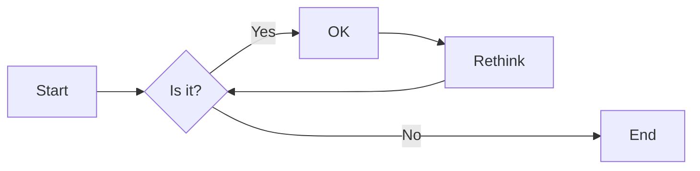
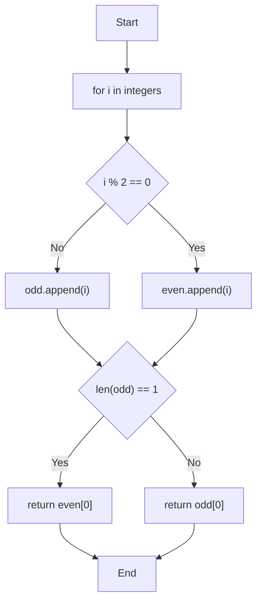

# 实验五 Python数据结构与数据模型

班级： 21计科3

学号：  B20210302324    

姓名： 唐佳喜

Github地址：https://github.com/Jecxy/Python_Learning

CodeWars地址：https://www.codewars.com/users/Jecxy

---

## 实验目的

1. 学习Python数据结构的高级用法
2. 学习Python的数据模型

## 实验环境

1. Git
2. Python 3.10
3. VSCode
4. VSCode插件

## 实验内容和步骤

### 第一部分

在[Codewars网站](https://www.codewars.com)注册账号，完成下列Kata挑战：

---

#### 第一题：停止逆转我的单词

难度： 6kyu

编写一个函数，接收一个或多个单词的字符串，并返回相同的字符串，但所有5个或更多的字母单词都是相反的（就像这个Kata的名字一样）。传入的字符串将只由字母和空格组成。只有当出现一个以上的单词时，才会包括空格。
例如：

```python
spinWords( "Hey fellow warriors" ) => returns "Hey wollef sroirraw" 
spinWords( "This is a test") => returns "This is a test" 
spinWords( "This is another test" )=> returns "This is rehtona test"
```

代码提交地址：
<https://www.codewars.com/kata/5264d2b162488dc400000001>

提示：

- 利用str的split方法可以将字符串分为单词列表
例如：

```python
words = "hey fellow warrior".split()
# words should be ['hey', 'fellow', 'warrior']
```
- 利用列表推导将长度大于等于5的单词反转(利用切片word[::-1])
- 最后使用str的join方法连结列表中的单词。

---

#### 第二题： 发现离群的数(Find The Parity Outlier)

难度：6kyu

给你一个包含整数的数组（其长度至少为3，但可能非常大）。该数组要么完全由奇数组成，要么完全由偶数组成，除了一个整数N。请写一个方法，以该数组为参数，返回这个 "离群 "的N。

例如：

```python
[2, 4, 0, 100, 4, 11, 2602, 36]
# Should return: 11 (the only odd number)

[160, 3, 1719, 19, 11, 13, -21]
# Should return: 160 (the only even number)
```

代码提交地址：
<https://www.codewars.com/kata/5526fc09a1bbd946250002dc>

---

#### 第三题： 检测Pangram

难度：6kyu

pangram是一个至少包含每个字母一次的句子。例如，"The quick brown fox jumps over the lazy dog "这个句子就是一个pangram，因为它至少使用了一次字母A-Z（大小写不相关）。

给定一个字符串，检测它是否是一个pangram。如果是则返回`True`，如果不是则返回`False`。忽略数字和标点符号。
代码提交地址：
<https://www.codewars.com/kata/545cedaa9943f7fe7b000048>

---

#### 第四题： 数独解决方案验证

难度：6kyu

数独背景

数独是一种在 9x9 网格上进行的游戏。游戏的目标是用 1 到 9 的数字填充网格的所有单元格，以便每一列、每一行和九个 3x3 子网格（也称为块）中的都包含数字 1 到 9。更多信息请访问：<http://en.wikipedia.org/wiki/Sudoku>

编写一个函数接受一个代表数独板的二维数组，如果它是一个有效的解决方案则返回 true，否则返回 false。数独板的单元格也可能包含 0，这将代表空单元格。包含一个或多个零的棋盘被认为是无效的解决方案。棋盘总是 9 x 9 格，每个格只包含 0 到 9 之间的整数。

代码提交地址：
<https://www.codewars.com/kata/63d1bac72de941033dbf87ae>

---

#### 第五题： 疯狂的彩色三角形

难度： 2kyu

一个彩色的三角形是由一排颜色组成的，每一排都是红色、绿色或蓝色。连续的几行，每一行都比上一行少一种颜色，是通过考虑前一行中的两个相接触的颜色而产生的。如果这些颜色是相同的，那么新的一行就使用相同的颜色。如果它们不同，则在新的一行中使用缺失的颜色。这个过程一直持续到最后一行，只有一种颜色被生成。

例如：
```python
Colour here:            G G        B G        R G        B R
Becomes colour here:     G          R          B          G
```


一个更大的三角形例子：

```python
R R G B R G B B
 R B R G B R B
  G G B R G G
   G R G B G
    B B R R
     B G R
      R B
       G
```

你将得到三角形的第一行字符串，你的工作是返回最后的颜色，这将出现在最下面一行的字符串。在上面的例子中，你将得到 "RRGBRGBB"，你应该返回 "G"。
限制条件： 1 <= length(row) <= 10 ** 5
输入的字符串将只包含大写字母'B'、'G'或'R'。

例如：

```python
triangle('B') == 'B'
triangle('GB') == 'R'
triangle('RRR') == 'R'
triangle('RGBG') == 'B'
triangle('RBRGBRB') == 'G'
triangle('RBRGBRBGGRRRBGBBBGG') == 'G'
```

代码提交地址：
<https://www.codewars.com/kata/5a331ea7ee1aae8f24000175>

提示：请参考下面的链接，利用三进制的特点来进行计算。
<https://stackoverflow.com/questions/53585022/three-colors-triangles>

---

### 第二部分

使用Mermaid绘制程序流程图

安装VSCode插件：

- Markdown Preview Mermaid Support
- Mermaid Markdown Syntax Highlighting

使用Markdown语法绘制你的程序绘制程序流程图（至少一个），Markdown代码如下：


显示效果如下：



查看Mermaid流程图语法-->[点击这里](https://mermaid.js.org/syntax/flowchart.html)

使用Markdown编辑器（例如VScode）编写本次实验的实验报告，包括[实验过程与结果](#实验过程与结果)、[实验考查](#实验考查)和[实验总结](#实验总结)，并将其导出为 **PDF格式** 来提交。

## 实验过程与结果

请将实验过程与结果放在这里，包括：

- [第一部分 Codewars Kata挑战](#第一部分)

1. 停止逆转我的单词
```python
def spin_words(sentence):
    # Your code goes here
    words=sentence.split()
    spinning_words = [word[::-1] if len(word) >= 5 else word for word in words]
    result = " ".join(spinning_words)
    return result
```
2. 发现离群的数(Find The Parity Outlier)
```python
def find_outlier(integers):
    odds=[x for x in integers if x%2!=0]
    evens= [x for x in integers if x%2==0]
    return odds[0] if len(odds)<len(evens) else evens[0]
```
3. 检测Pangram
```python
def is_pangram(s):
    s=s.lower()
    for char in 'abcdefghijklmnopqrstuvwxyz':
        if char not in s:
            return False
    return True
```
4. 数独解决方案验证
```python
def validate_sudoku(board):
    
    # 利用集合进行比较 {1,2,3,4,5,6,7,8,9}
    elements = set(range(1, 10))
    
    # row
    for b in board:
        if set(b) != elements: 
            return False
    
    # column
    for b in zip(*board):   # zip(*board) 可以将矩阵转置
        if set(b) != elements: 
            return False
    
    # magic squares
    for i in range(3, 10, 3):
        for j in range(3, 10, 3):
            if elements != {(board[q][w]) 
                            for w in range(j-3, j) 
                            for q in range(i-3, i)}:
                return False
            
    return True
```
5. 疯狂的彩色三角形
```python
def triangle(row):
    # 最长的测试用例长度不会超过100000
    # 找到小于100000的所有的3的幂加1，从大到小排序
    # reduce 应该等于[3**9+1, 3**8+1, ... , 3**1+1,  3**0+1]
    reduce=[3**i+1 for i in range(10) if 3**i<=100000][::-1]
    
    COLOR = {'GG':'G', 'BB':'B', 'RR':'R', 'BR':'G', 
            'BG':'R', 'GB':'R', 'GR':'B', 'RG':'B', 'RB':'G'}
    
    # 从reduce里面最长的长度间隔，取出row里面的元素相加
    for length in reduce:
        while len(row)>=length:
            # row=[row[i] if row[i]==row[i+length-1] else ({"R","G","B"}-{row[i],row[i+length-1]}).pop() for i in range(len(row)-length+1)]
            row=[ COLOR[row[i] + row[i+length-1]] for i in range(len(row)-length+1)]
    return row[0]
```
- [第二部分 使用Mermaid绘制程序流程图](#第二部分)
- 


## 实验考查

请使用自己的语言并使用尽量简短代码示例回答下面的问题，这些问题将在实验检查时用于提问和答辩以及实际的操作。

1. 集合（set）类型有什么特点？它和列表（list）类型有什么区别？

与列表（list）类型相比，集合类型有以下区别：
唯一性：集合中的元素是唯一的，而列表中的元素可以重复。
无序性：集合中的元素没有固定的顺序，而列表中的元素有顺序。
可变性：集合是可变的，可以添加、删除和修改元素，而列表也是可变的。

2. 集合（set）类型主要有那些操作？

添加元素：可以使用 add() 方法向集合中添加元素。
删除元素：可以使用 remove() 方法从集合中删除指定元素，或使用 pop() 方法随机删除一个元素。
清空集合：可以使用 *****() 方法清空集合中的所有元素。
判断元素是否在集合中：可以使用 in 关键字或者使用 contains() 方法判断元素是否在集合中。
集合运算：可以使用交集（&）、并集（|）、差集（-）等运算操作两个集合。
集合长度：可以使用 len() 方法获取集合中元素的个数。
遍历集合：可以使用 for 循环遍历集合中的所有元素。

3. 使用`*`操作符作用到列表上会产生什么效果？为什么不能使用`*`操作符作用到嵌套的列表上？使用简单的代码示例说明。

在Python中，* 操作符可以用于解压缩可迭代对象，例如列表或元组。当 * 操作符作用于一个列表时，它会将列表中的元素解压缩并作为独立的参数传递给函数或构造新的列表。然而，当 * 操作符作用于嵌套的列表时，它只会解压一层嵌套，而不会递归地解压内部的列表。例如*[1, 2, 3]结果为1 2 3，而*[[1, 2], 3]结果为[1, 2] 3。

4. 总结列表,集合，字典的解析（comprehension）的使用方法。使用简单的代码示例说明。

##### 列表解析（List Comprehension）：
列表解析提供了一种简洁的方法来创建新的列表。它的基本语法是在一个可迭代的对象上应用一个表达式，通常伴随着条件语句。

1.创建一个包含平方数的列表
  squared_numbers = [x**2 for x in range(1, 6)]
  print(squared_numbers)  # 输出: [1, 4, 9, 16, 25]
2.使用条件语句过滤列表中的元素
  even_numbers = [x for x in range(10) if x % 2 == 0]
  print(even_numbers)  # 输出: [0, 2, 4, 6, 8]

##### 集合解析（Set Comprehension）：
集合解析类似于列表解析，但是创建的是集合而不是列表。

1.创建一个包含平方数的集合
  squared_numbers_set = {x**2 for x in range(1, 6)}
  print(squared_numbers_set)  # 输出: {1, 4, 9, 16, 25}
2.使用条件语句过滤集合中的元素
  even_numbers_set = {x for x in range(10) if x % 2 == 0}
  print(even_numbers_set)  # 输出: {0, 2, 4, 6, 8}

##### 字典解析（Dictionary Comprehension）：
字典解析允许你以简洁的方式创建字典，你可以指定键值对以及可选的条件语句。

1.创建一个包含数字及其平方的字典
  squared_dict = {x: x**2 for x in range(1, 6)}
  print(squared_dict)  # 输出: {1: 1, 2: 4, 3: 9, 4: 16, 5: 25}

2.使用条件语句过滤字典中的元素
  even_squared_dict = {x: x**2 for x in range(10) if x % 2 == 0}
  print(even_squared_dict)  # 输出: {0: 0, 2: 4, 4: 16, 6: 36, 8: 64}
## 实验总结

在本次实验中，我学会了Python的列表、集合数据类型之间的区别，也了解了列表的基本语句与操作，学习Python的*操作在列表上的作用，也熟悉了集合、列表、字典的使用。