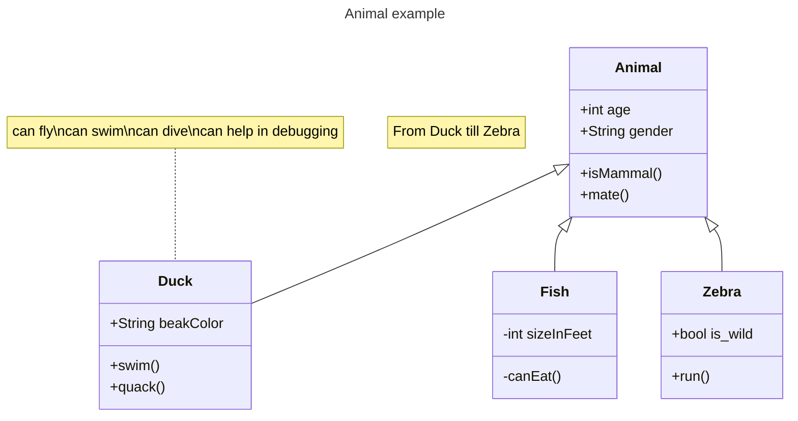
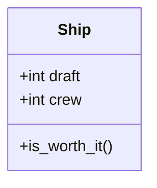

# 实验七 Python面向对象编程

班级： 21计科3

学号： B20210302324

姓名： 唐佳喜

Github地址：https://github.com/Jecxy/Python_Learning

CodeWars地址：https://www.codewars.com/users/Jecxy

---

## 实验目的

1. 学习Python类和继承的基础知识
2. 学习namedtuple和DataClass的使用

## 实验环境

1. Git
2. Python 3.10
3. VSCode
4. VSCode插件

## 实验内容和步骤

### 第一部分

Python面向对象编程

完成教材《Python编程从入门到实践》下列章节的练习：

- 第9章 类

---

### 第二部分

在[Codewars网站](https://www.codewars.com)注册账号，完成下列Kata挑战：

---

#### 第一题：面向对象的海盗

难度： 8kyu

啊哈，伙计!

你是一个小海盗团的首领。而且你有一个计划。在OOP的帮助下，你希望建立一个相当有效的系统来识别船上有大量战利品的船只。
对你来说，不幸的是，现在的人很重，那么你怎么知道一艘船上装的是黄金而不是人呢？

你首先要写一个通用的船舶类。

```python
class Ship:
    def __init__(self, draft, crew):
        self.draft = draft
        self.crew = crew
```

每当你的间谍看到一艘新船进入码头，他们将根据观察结果创建一个新的船舶对象。

- `draft`吃水 - 根据船在水中的高度来估计它的重量
- `crew`船员 - 船上船员的数量

`Titanic = Ship(15, 10)`

任务

你可以访问船舶的 "draft(吃水) "和 "crew(船员)"。"draft(吃水) "是船的总重量，"船员 "是船上的人数。
每个船员都会给船的吃水增加1.5个单位。如果除去船员的重量后，吃水仍然超过20，那么这艘船就值得掠夺。任何有这么重的船一定有很多战利品!
添加方法
`is_worth_it`
来决定这艘船是否值得掠夺。

例如：

```python
Titanic.is_worth_it()
False
```

祝你好运，愿你能找到金子!

代码提交地址：
<https://www.codewars.com/kata/54fe05c4762e2e3047000add>

---

#### 第二题： 搭建积木

难度：7kyu

写一个创建Block的类（Duh.）
构造函数应该接受一个数组作为参数，这个数组将包含3个整数，其形式为`[width, length, height]`，Block应该由这些整数创建。

定义这些方法:

- `get_width()` return the width of the `Block`
- `get_length()` return the length of the `Block`
- `get_height()` return the height of the `Block`
- `get_volume()` return the volume of the `Block`
- `get_surface_area()` return the surface area of the `Block`

例子：

```python
b = Block([2,4,6]) # create a `Block` object with a width of `2` a length of `4` and a height of `6`
b.get_width() # return 2    
b.get_length() # return 4
b.get_height() # return 6
b.get_volume() # return 48
b.get_surface_area() # return 88
```

注意： 不需要检查错误的参数。

代码提交地址：
<https://www.codewars.com/kata/55b75fcf67e558d3750000a3>

---

#### 第三题： 分页助手

难度：5kyu

在这个练习中，你将加强对分页的掌握。你将完成PaginationHelper类，这是一个实用类，有助于查询与数组有关的分页信息。
该类被设计成接收一个值的数组和一个整数，表示每页允许多少个项目。集合/数组中包含的值的类型并不相关。

下面是一些关于如何使用这个类的例子：

```python
helper = PaginationHelper(['a','b','c','d','e','f'], 4)
helper.page_count() # should == 2
helper.item_count() # should == 6
helper.page_item_count(0)  # should == 4
helper.page_item_count(1) # last page - should == 2
helper.page_item_count(2) # should == -1 since the page is invalid

# page_index takes an item index and returns the page that it belongs on
helper.page_index(5) # should == 1 (zero based index)
helper.page_index(2) # should == 0
helper.page_index(20) # should == -1
helper.page_index(-10) # should == -1 because negative indexes are invalid
```

代码提交地址：
<https://www.codewars.com/kata/515bb423de843ea99400000a>

---

#### 第四题： 向量（Vector）类

难度： 5kyu

创建一个支持加法、减法、点积和向量长度的向量（Vector）类。

举例来说：

```python
a = Vector([1, 2, 3])
b = Vector([3, 4, 5])
c = Vector([5, 6, 7, 8])

a.add(b)      # should return a new Vector([4, 6, 8])
a.subtract(b) # should return a new Vector([-2, -2, -2])
a.dot(b)      # should return 1*3 + 2*4 + 3*5 = 26
a.norm()      # should return sqrt(1^2 + 2^2 + 3^2) = sqrt(14)
a.add(c)      # raises an exception
```

如果你试图对两个不同长度的向量进行加减或点缀，你必须抛出一个错误。
向量类还应该提供：

- 一个 `__str__` 方法，这样 `str(a) === '(1,2,3)'` 
- 一个equals方法，用来检查两个具有相同成分的向量是否相等。

注意：测试案例将利用用户提供的equals方法。

代码提交地址：
<https://www.codewars.com/kata/526dad7f8c0eb5c4640000a4>

---

#### 第五题： Codewars风格的等级系统

难度： 4kyu

编写一个名为User的类，用于计算用户在类似于Codewars使用的排名系统中的进步量。

业务规则：

- 一个用户从等级-8开始，可以一直进步到8。
- 没有0（零）等级。在-1之后的下一个等级是1。
- 用户将完成活动。这些活动也有等级。
- 每当用户完成一个有等级的活动，用户的等级进度就会根据活动的等级进行更新。
- 完成活动获得的进度是相对于用户当前的等级与活动的等级而言的。
- 用户的等级进度从零开始，每当进度达到100时，用户的等级就会升级到下一个等级。
- 在上一等级时获得的任何剩余进度都将被应用于下一等级的进度（我们不会丢弃任何进度）。例外的情况是，如果没有其他等级的进展（一旦你达到8级，就没有更多的进展了）。
- 一个用户不能超过8级。
- 唯一可接受的等级值范围是-8,-7,-6,-5,-4,-3,-2,-1,1,2,3,4,5,6,7,8。任何其他的值都应该引起错误。

逻辑案例：

- 如果一个排名为-8的用户完成了一个排名为-7的活动，他们将获得10的进度。
- 如果一个排名为-8的用户完成了排名为-6的活动，他们将获得40的进展。
- 如果一个排名为-8的用户完成了排名为-5的活动，他们将获得90的进展。
- 如果一个排名-8的用户完成了排名-4的活动，他们将获得160个进度，从而使该用户升级到排名-7，并获得60个进度以获得下一个排名。
- 如果一个等级为-1的用户完成了一个等级为1的活动，他们将获得10个进度（记住，零等级会被忽略）。

代码案例：

```python
user = User()
user.rank # => -8
user.progress # => 0
user.inc_progress(-7)
user.progress # => 10
user.inc_progress(-5) # will add 90 progress
user.progress # => 0 # progress is now zero
user.rank # => -7 # rank was upgraded to -7
```

代码提交地址：
<https://www.codewars.com/kata/51fda2d95d6efda45e00004e>

---

### 第三部分

使用Mermaid绘制程序的**类图**

安装VSCode插件：

- Markdown Preview Mermaid Support
- Mermaid Markdown Syntax Highlighting

使用Markdown语法绘制你的程序绘制程序类图（至少一个），Markdown代码如下：


显示效果如下：



查看Mermaid类图的语法-->[点击这里](https://mermaid.js.org/syntax/classDiagram.html)

使用Markdown编辑器（例如VScode）编写本次实验的实验报告，包括[实验过程与结果](#实验过程与结果)、[实验考查](#实验考查)和[实验总结](#实验总结)，并将其导出为 **PDF格式** 来提交。

## 实验过程与结果

请将实验过程与结果放在这里，包括：

- [第一部分 Python面向对象编程](#第一部分)
```python
# 练习 9-1 餐馆：
# 1.创建一个名为Restaurant的类，其方法__init__()设置两个属性：
# restaurant_name和cuisine_type.创建一个名为describe_restaurant()方法和一个名为open_restaurant()的方法，
# 其中前者打印前述两项信息，而后者打印一条消息，指出餐馆正在营业.
# 2.根据这个类创建一个名为restaurant的实例，分别打印其两个属性，再调用前述两个方法。
class Restaurant():

    def __init__(self, restaurant_name, cuisine_type):
        self.restaurant_name = restaurant_name
        self.cuisine_type = cuisine_type

    def describe_restaurant(self):
        print("餐厅的名字：" + self.restaurant_name)
        print("烹饪方法：" + self.cuisine_type)

    def open_restaurant(self):
        print("The " + self.restaurant_name + " is open.")


restaurant = Restaurant('人间美味', '中餐')

print("餐厅的名字：" + restaurant.restaurant_name)
print("烹饪方法：" + restaurant.cuisine_type)
restaurant.describe_restaurant()
restaurant.open_restaurant()

#输出结果
#餐厅的名字：人间美味
#烹饪方法：中餐
#餐厅的名字：人间美味
#烹饪方法：中餐
#The 人间美味 is open.
```

```python
# 练习 9-2 三家餐馆：
# 根据你为完成练习题9-1而编写的类创建三个实例，并对每个实例调用方法describe_restaurant().
class Restaurant():

    def __init__(self, restaurant_name, cuisine_type):
        self.restaurant_name = restaurant_name
        self.cuisine_type = cuisine_type

    def describe_restaurant(self):
        print("餐厅的名字：" + self.restaurant_name)
        print("烹饪方法：" + self.cuisine_type)

    def open_restaurant(self):
        print("The " + self.restaurant_name + " is open.")


a_restaurant = Restaurant('餐厅a', '中餐')
b_restaurant = Restaurant('餐厅b', '西餐')
c_restaurant = Restaurant('餐厅c', '快餐')

a_restaurant.describe_restaurant()
b_restaurant.describe_restaurant()
c_restaurant.describe_restaurant()

#输出结果
#餐厅的名字：餐厅a
#烹饪方法：中餐
#餐厅的名字：餐厅b
#烹饪方法：西餐
#餐厅的名字：餐厅c
#烹饪方法：快餐
```

```python
# 练习 9-3 用户：
# 1.创建一个名为User的类，其中包含属性first_name和last_name,还有用户简介通常会存储的其他几个属性。
# 在类User中定义一个名为describe_user()的方法，它打印用户信息摘要;再定义一个名为great_user()方法，它向用户发出个性化的问候。
# 2.创建多个表示不同用户的实例，并对每个实例都调用上述两个方法。
class User():

    def __init__(self, first_name, last_name, where_from):
        self.first_name = first_name
        self.last_name = last_name
        self.where_from = where_from

    def describe_user(self):
        print("姓:" + self.first_name)
        print("名:" + self.last_name)
        print("来自:" + self.where_from)

    def great_user(self):
        print("你好: " + self.first_name + self.last_name +
              " 欢迎你来到Python世界.")


a_user = User('张', '三', '中国')
b_user = User('李', '四', '中国')

a_user.describe_user()
a_user.great_user()
print("---------------")

b_user.describe_user()
b_user.great_user()

#输出结果
#姓:张
#名:三
#来自:中国
#你好: 张三 欢迎你来到Python世界.
#---------------
#姓:李
#名:四
#来自:中国
#你好: 李四 欢迎你来到Python世界.
```

```python
# 练习 9-4就餐人数 ：
# 在为完成练习9-1而编写的程序中， 添加一个名为number_served 的属性， 并将其默认值设置为0。
# 根据这个类创建一个名为restaurant 的实例； 打印有多少人在这家餐馆就餐过， 然后修改这个值并再次打印它。
# 添加一个名为set_number_served() 的方法， 它让你能够设置就餐人数。
# 调用这个方法并向它传递一个值， 然后再次打印这个值。
# 添加一个名为increment_number_served() 的方法， 它让你能够将就餐人数递增。
# 调用这个方法并向它传递一个这样的值： 你认为这家餐馆每天可能接待的就餐人数。
class Restaurant():

    def __init__(self, restaurant_name, cuisine_type):
        self.name = restaurant_name
        self.type = cuisine_type
        self.number_served = 0

    def read_number(self):
        print("The restaurant has " + str(self.number_served) + " customer now.")

    def set_number_served(self, number):
        self.number_served = number

    def increment_number_served(self, number):
        if int(number) + self.number_served <= 20:
            self.number_served += number
        else:
            print("The restaurant is full now.")


restaurant = Restaurant('KFCC', 'nothing')

restaurant.set_number_served(5)

restaurant.increment_number_served(5)
restaurant.increment_number_served(4)
restaurant.increment_number_served(6)
restaurant.increment_number_served(2)

restaurant.read_number()

#输出结果
#The restaurant is full now.
#The restaurant has 20 customer now.
```

```python
# 练习 9-6冰淇淋小店 ：
# 冰淇淋小店是一种特殊的餐馆。 编写一个名为IceCreamStand 的类， 让它继承你为完成练习9-1或练习9-4而编写的Restaurant 类。
# 这两个版本的Restaurant 类都可以， 挑选你更喜欢的那个即可。
# 添加一个名为flavors 的属性， 用于存储一个由各种口味的冰淇淋组成的列表。
# 编写一个显示这些冰淇淋的方法。
# 创建一个IceCreamStand 实例， 并调用这个方法。
class Restaurant():

    def __init__(self, restaurant_name, cuisine_type):
        self.name = restaurant_name
        self.type = cuisine_type


class IceCreamStand(Restaurant):

    def __init__(self, restaurant_name, cuisine_type, *flavors):
        super().__init__(restaurant_name, cuisine_type)
        self.flavors = flavors


ice = IceCreamStand('Haagen-Dazs', 'ice cream', 'original flavor', 'orange',
                    'chocolate')

print(ice.flavors)

#输出结果('original flavor', 'orange', 'chocolate')
```
- [第二部分 Codewars Kata挑战](#第二部分)

第一题：面向对象的海盗
```python
class Ship:
    def __init__(self, draft, crew):
        self.draft = draft
        self.crew = crew
    def is_worth_it(self):
        if self.draft-self.crew*1.5>20:
            return True
        else:
            return False
```
第二题： 搭建积木
```python
class Block:
    def __init__(self, block):
        self.length = block[1]
        self.width = block[0]
        self.height = block[2]

    def get_width(self):
        return self.width

    def get_length(self):
        return self.length

    def get_height(self):
        return self.height

    def get_volume(self):
        height = self.get_height()
        length = self.get_length()
        width = self.get_width()

        return height * width * length

    def get_surface_area(self):
        height = self.get_height()
        length = self.get_length()
        width = self.get_width()

        return (length * width * 2) + (length * height * 2) + (width * height * 2)
```
第三题： 分页助手
```python
class PaginationHelper:

    def __init__(self, collection, items_per_page):
        self.collection = collection
        self.items_per_page = items_per_page

    def item_count(self):
        return len(self.collection)

    def page_count(self):
        count = len(self.collection) // self.items_per_page
        if len(self.collection) % self.items_per_page == 0:
            return count
        else:
            return count + 1

    def page_item_count(self, page_index):
        count = self.page_count()
        item_count = [[]] * count
        if page_index >= count or page_index < 0:
            return -1
        else:
            for i in range(count):
                item_count[i] = self.collection[i * self.items_per_page:(i + 1) * self.items_per_page]
            return len(item_count[page_index])

    def page_index(self, item_index):
        if item_index >= len(self.collection):
            return -1
        else:
            empty = []
            if self.collection == empty:
                return -1
            else:
                n, m = divmod(item_index, self.items_per_page)
                count = self.page_count()
                if n >= count or item_index < 0:
                    return -1
                else:
                    return n
```
第四题： 向量（Vector）类
```python
from math import sqrt


class Vector:
    def __init__(self, vector):
        self.new_list = vector

    def __str__(self):
        s = ",".join([str(element) for element in self.new_list])
        return '(%s)' % s

    def equals(self, vector):
        if self.__str__() == vector.__str__():
            return True
        else:
            return False

    def compare(self, vector):
        if len(self.new_list) == len(vector.new_list):
            return True
        else:
            return False

    def norm(self):
        return sqrt(self.new_list[0] ** 2 + self.new_list[1] ** 2 + self.new_list[2] ** 2)

    def add(self, Object):
        if self.compare(Object):
            new_vector = Vector
            new_list = []
            for i in range(len(self.new_list)):
                new_list.append(self.new_list[i] + Object.new_list[i])
            return new_vector(new_list)
        else:
            return 'raises an exception'

    def subtract(self, vector):
        if self.compare(vector):
            new_vector = Vector
            new_list = []
            for i in range(len(self.new_list)):
                new_list.append(self.new_list[i] - vector.new_list[i])
            return new_vector(new_list)
        else:
            return 'raises an exception'

    def dot(self, vector):
        if self.compare(vector):
            sum_number = 0
            for i in range(len(self.new_list)):
                sum_number += (self.new_list[i] * vector.new_list[i])

            return sum_number
        else:
            return 'raises an exception'
```

第五题： Codewars风格的等级系统
```python
class User ():    
    def __init__ (self):
        self.RANKS = [-8, -7, -6, -5, -4, -3, -2, -1, 1, 2, 3, 4, 5, 6, 7, 8]
        self.rank = -8
        self.rank_index = 0
        self.progress = 0
        
    def inc_progress (self, rank):
        rank_index = self.RANKS.index(rank)
        
        if rank_index == self.rank_index:
            self.progress += 3
            
        elif rank_index == self.rank_index - 1:
            self.progress += 1
            
        elif rank_index > self.rank_index:
            difference = rank_index - self.rank_index
            self.progress += 10 * difference * difference
         
        while self.progress >= 100:
            self.rank_index += 1
            self.rank = self.RANKS[self.rank_index]
            self.progress -= 100    

            if self.rank == 8:
                self.progress = 0
                return
```
- [第三部分 使用Mermaid绘制程序流程图](#第三部分)
kata第一题 船


## 实验考查

请使用自己的语言并使用尽量简短代码示例回答下面的问题，这些问题将在实验检查时用于提问和答辩以及实际的操作。

1. Python的类中__init__方法起什么作用？
__init__方法的主要作用是对类的实例进行初始化，可以在该方法中定义实例的属性，并为这些属性赋予初始值。当创建类的实例时，会自动调用__init__方法，并将实例本身作为第一个参数传递给该方法，通常被约定为self。

2. Python语言中如何继承父类和改写（override）父类的方法。
要继承父类，可以在定义子类时，在类名后面加上父类的名称，并用括号括起来。子类可以继承父类的所有属性和方法。
要改写父类的方法，只需要在子类中定义一个同名的方法，并在其中实现新的逻辑。在子类中调用父类的方法，可以使用super()函数。

3. Python类有那些特殊的方法？它们的作用是什么？请举三个例子并编写简单的代码说明。
__init__方法：这是一个类的构造方法，在创建类的实例时自动调用。它用于初始化对象的属性。 __str__方法：这个方法用于返回对象的字符串表示。当使用print函数打印对象时，会自动调用该方法。 __len__方法：这个方法用于返回对象的长度。当使用len函数计算对象的长度时，会自动调用该方法。

## 实验总结

在本次实验中，我了解了python的类，学习了类的方法与属性的命名使用，也了解了类中的父类与子类之间的继承与改写关系，也掌握了一些类的基础方法 像__init__、__str__等等。
