# 《Python程序设计基础》程序设计作品说明书

题目： 外星人入侵游戏👽

学院： 21计科03班

姓名： 唐佳喜

学号： B20210302324

指导教师： 周景

起止日期：2023.11.10-2023.12.10

## 摘要

在Windows操作系统环境下，实现飞船大战外星人的游戏操作功能。介绍了该项目的基本设计思路与方法。在该设计中，飞船可以在一定区域内自由移动，并且可以发射子弹，子弹可以击中外星人,增加分数，外星人可以撞击飞船，游戏结束条件为飞船被击中或主动退出游戏。同时帮助用户进一步理解和掌握Python各种基本类型的变量、数据类型、类、用户输入和文件操作实现面向对象的游戏开发，以及它们在程序中的使用方法。

关键词：Python语言、 Pygame模块、飞机大战外星人、游戏初级编程实例

## 第1章 需求分析

### 1.1 功能需求

(1) 游戏的开始界面，当点击开始时就可以开始游戏。
(2) 游戏中的飞船的移动需要限定在屏幕范围内。
(3) 游戏中需要使用记分板来统计分数。
(4) 游戏中的子弹发射需要限定在屏幕范围内。
(5) 游戏中的子弹需要击中外星人，同时与外星人一起消失。
(6) 游戏中的外星人需要限定数量并在全部消失后再生成。

### 1.2 设计目的

(1) 帮助用户度过无聊时间
(2) 帮助用户熟悉Python编程方法,熟悉Pygame类的方法与使用。
(3) 帮助用户熟悉面向对象编程思想。

## 第2章 分析与设计

### 2.1 系统架构

系统的总体设计框图
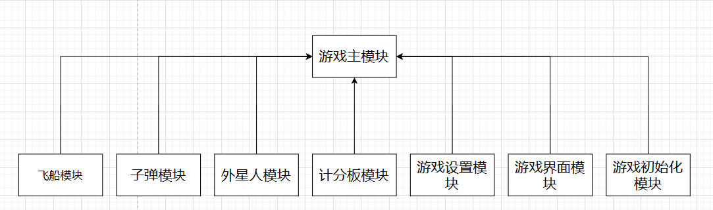

### 2.2 系统模块

该项目主要分为8个模块，分别为: 游戏设置模块、游戏界面模块、游戏初始化模块、子弹模块、外星人模块、飞船模块、计分板模块、 游戏主模块。

### 2.3 系统流程

(1)  游戏主模块: 程序主函数主要进行定义和继承的相关操作，实现成员函数的定义和成员属性的定义，继承相关函数并添加相关的游戏特性。
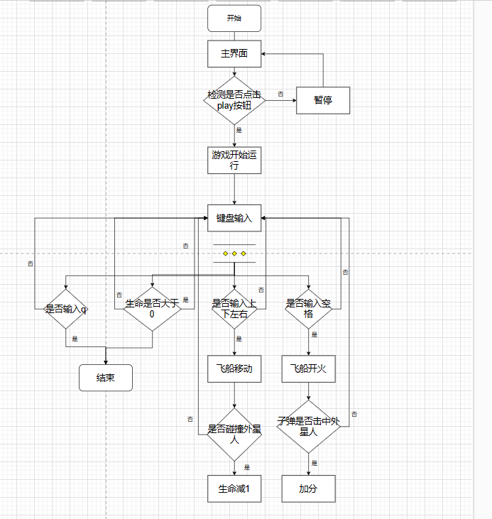

(2) 游戏界面模块： 该模块主要实现游戏的开始界面，当点击开始时就可以开始游戏。
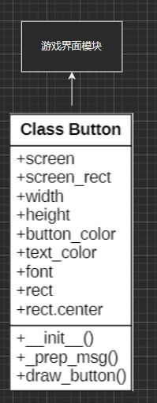

(3) 游戏设置模块： 该模块主要实现游戏的设置界面。
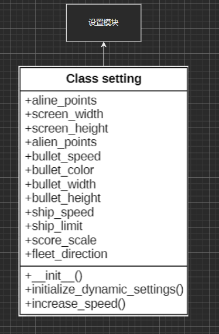

(4) 游戏初始化模块： 该模块主要实现游戏的初始化。
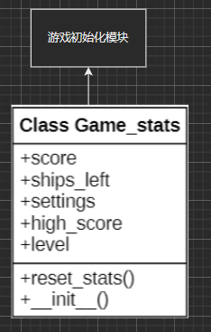

(5) 子弹模块： 该模块主要实现子弹的设置。
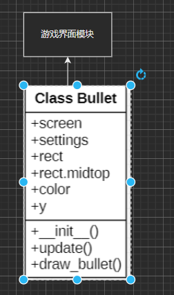

(6) 外星人模块： 该模块主要实现外星人的设置。
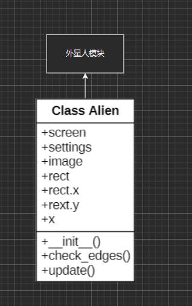

(7) 飞船模块： 该模块主要实现飞船的设置。
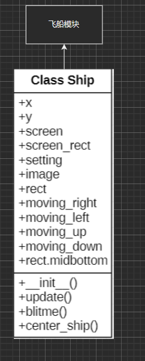
(8) 游戏分数模块： 该模块主要实现游戏分数的设置。
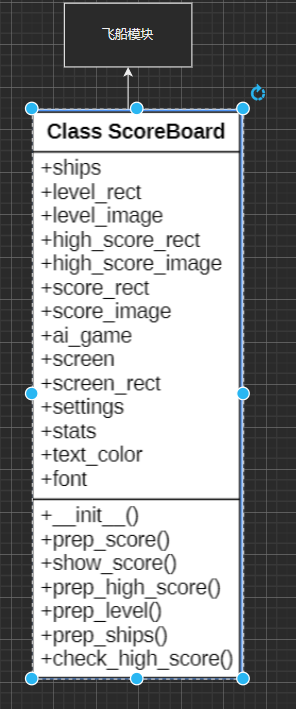
### 2.4 数据库的设计

该项目无数据库的设计相关的设计。

### 2.5 关键的实现

该项目的实现主要关键在于对于Python语言的强大丰富的库，其中Pygame库有着重大的作用。Pygame是Python的一个第三方库, 搭载了基于OpenGL的图形库和优质的音频库, 可以快速上手制作2D游戏的原型。Pygame的API比较偏底层, 开发人员在编程时具有很大的自由度, 同时具有了很强的可定制性，在Python语言提供的资源结构上库的模块研发是该项目的重要基础。

## 第3章 软件测试

### 1.1 类和函数的单元测试

(1) Alien类测试
```python
import pygame
from alien import Alien

# 创建一个虚拟的ai_game实例，可以使用Mock等方式
class MockSettings:
    alien_speed = 1
    fleet_direction = 1

class MockScreen:
    def get_rect(self):
        return pygame.Rect(0, 0, 800, 600)

class MockAiGame:
    def __init__(self):
        self.screen = MockScreen()
        self.settings = MockSettings()

def test_alien_update():
    ai_game = MockAiGame()
    alien = Alien(ai_game)

    alien.update()
    assert alien.rect.x == 51  # 验证横向移动是否符合预期

def test_alien_check_edges():
    ai_game = MockAiGame()
    alien = Alien(ai_game)

    screen_rect = alien.screen.get_rect()
    alien.rect.x = screen_rect.right - 1
    assert alien.check_edges() == True  # 验证边缘检查是否符合预期

    alien.rect.x = 0
    assert alien.check_edges() == True  # 验证边缘检查是否符合预期

    alien.rect.x = 10
    assert alien.check_edges() == None  # 验证边缘检查是否符合预期
```

(2) Game_Stats类测试

```python
import pytest
from game_stats import GameStats
from settings import Settings

class TestGameStats:
    @pytest.fixture
    def ai_game(self):
        settings = Settings()
        return AI_Game(settings)

    def test_reset_stats(self, ai_game):
        stats = GameStats(ai_game)  # 创建GameStats实例
        stats.score = 100  # 设置分数为100
        stats.ships_left = 2  # 设置飞船剩余数量为2
        stats.reset_stats()  # 调用reset_stats方法重置统计信息
        assert stats.score == 0  # 检查分数是否被重置为0
        assert stats.ships_left == ai_game.settings.ship_limit  # 检查飞船剩余数量是否被重置为初始值
        assert stats.high_score == 0  # 检查高分是否被重置为0
        assert stats.level == 1  # 检查等级是否被重置为1

class AI_Game:
    def __init__(self, settings):
        self.settings = settings

class Settings:
    def __init__(self):
        self.ship_limit = 3

```

(3) Bullet类测试

```python
import pygame
from bullet import Bullet


def test_bullet_update():
    ai_game = MockAiGame()  # 这里需要自行实现一个 MockAiGame 类
    bullet = Bullet(ai_game)
    bullet.update()
    assert bullet.rect.y == bullet.y

class MockAiGame:
    def __init__(self):
        self.screen = pygame.Surface((800, 600))
        self.settings = MockSettings()
        self.ship = MockShip()

class MockSettings:
    def __init__(self):
        self.bullet_color = (255, 255, 255)  # 设置合适的颜色
        self.bullet_width = 5  # 设置合适的宽度
        self.bullet_height = 10  # 设置合适的高度
        self.bullet_speed = 2  # 设置合适的速度

class MockShip:
    def __init__(self):
        self.rect = pygame.Rect(0, 0, 10, 10)  # 设置合适的坐标

    @property
    def midtop(self):
        return self.rect.midtop
```
 测试结果：
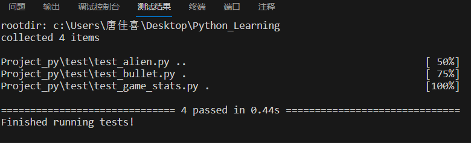

### 1.2 总体功能的测试

(1) 外星人功能测试
外星舰队
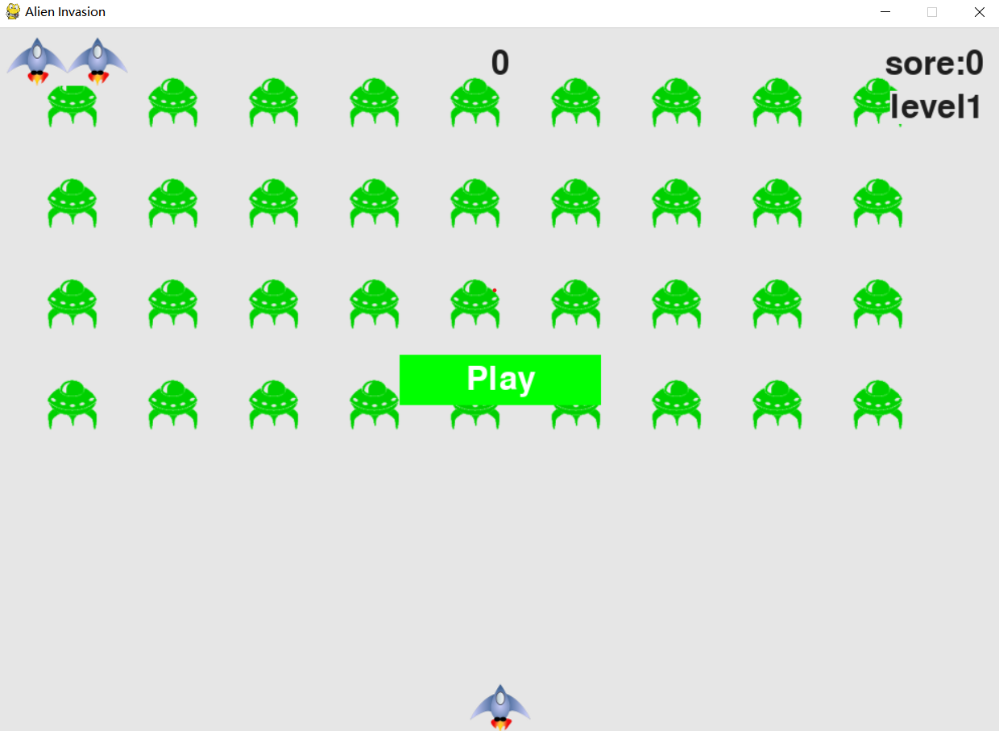

(2) 飞船功能测试
飞船移动
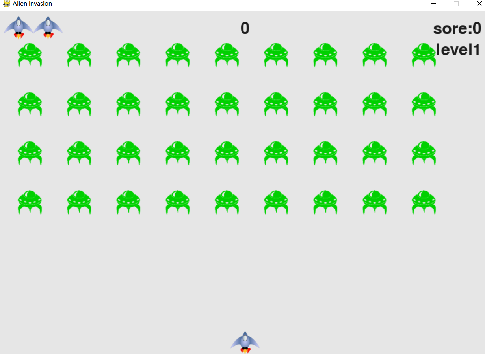
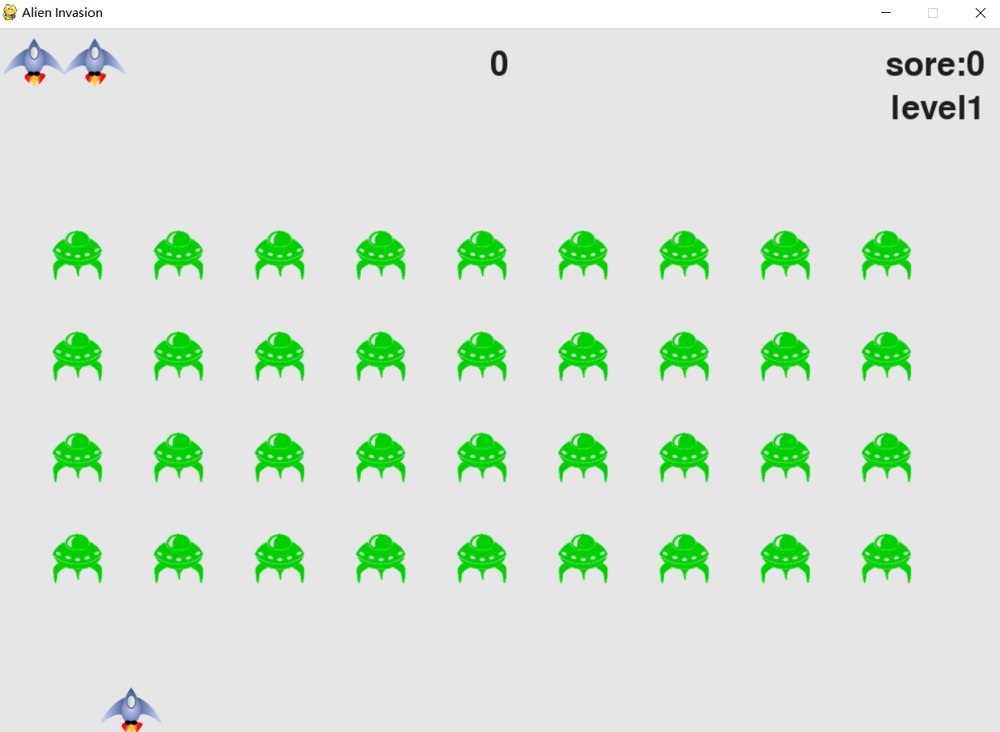

(3) 子弹功能测试
射击并消灭外星人
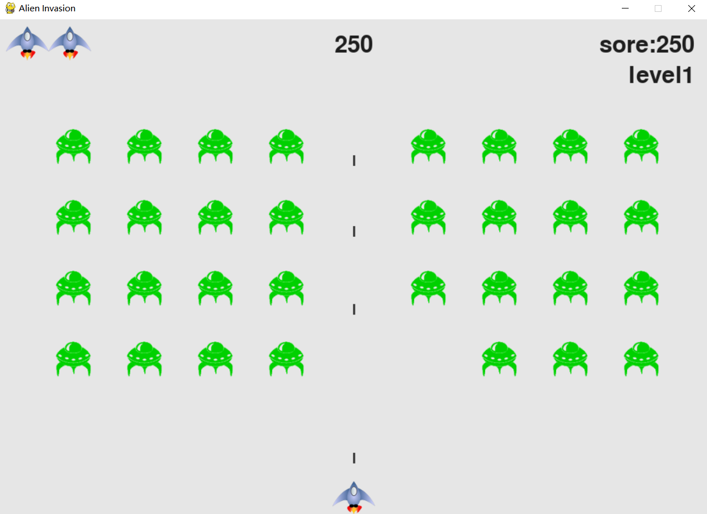

(4) 记分板功能测试
计分并显示最高分
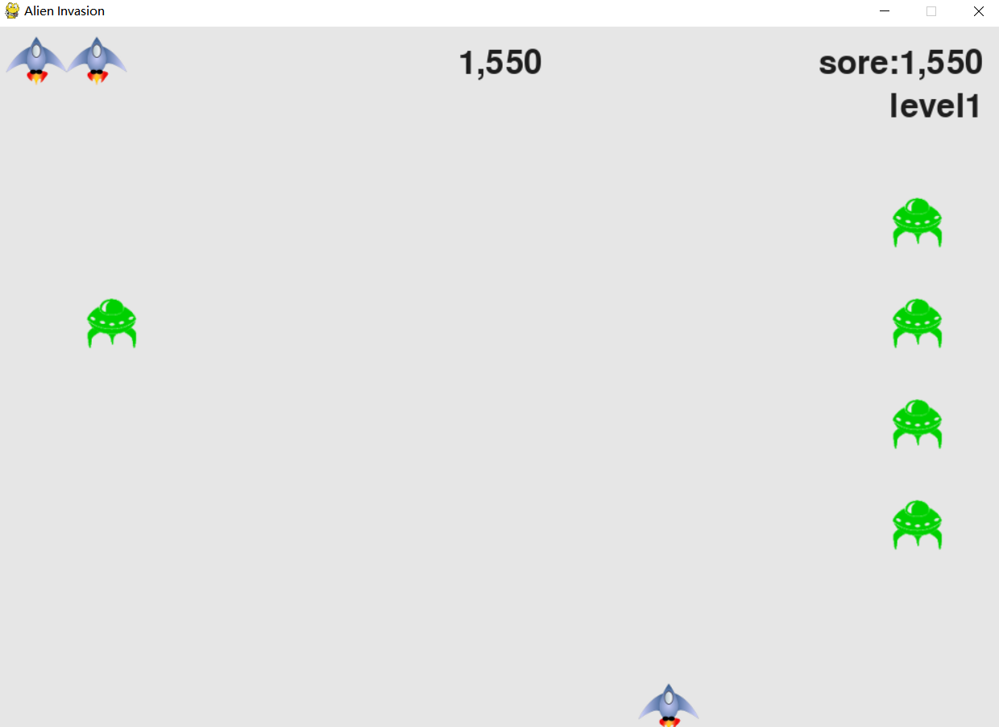
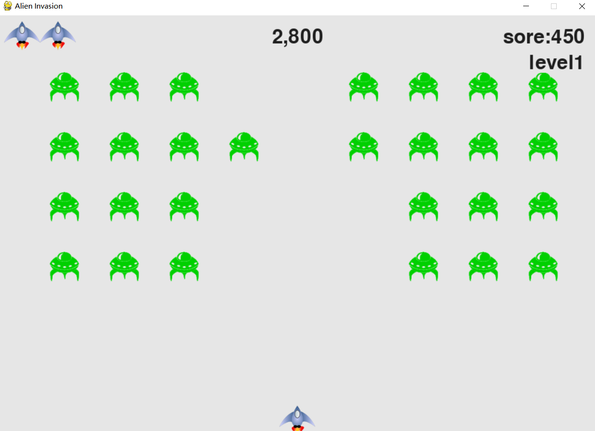

## 结论

该项目基本实现了飞船大战外形舰队游戏的功能，可以移动飞船并射击外星人，击中后子弹与外星人一同消失，并且获得相应分数累计加在右上角。击落屏幕内的全部外星人后再次新建外形舰队，并且右上角的等级加一，表示进入了新的一关。外星人会逐渐向屏幕下方移动，当外星人到达底部或者碰撞飞船时，生命值减一，当生命值减为零时，游戏结束。但是游戏仍然存在一些不足之处，例如：飞机与外星人相撞后，游戏结束，但是没有给出提示，玩家不知道如何继续游戏，还有飞机只有一个，不能够供玩家自由选择，飞机的攻击模式只有一种,外星人的出场模式是固定的，开始菜单与游戏界面在同一个画布上等等.

## 参考文献

[美] 埃里克·马瑟斯(Eric Matthes).Python编程-从入门到实践(第3版)[M].袁国忠译.北京: 人民邮电出版社, 2023.8